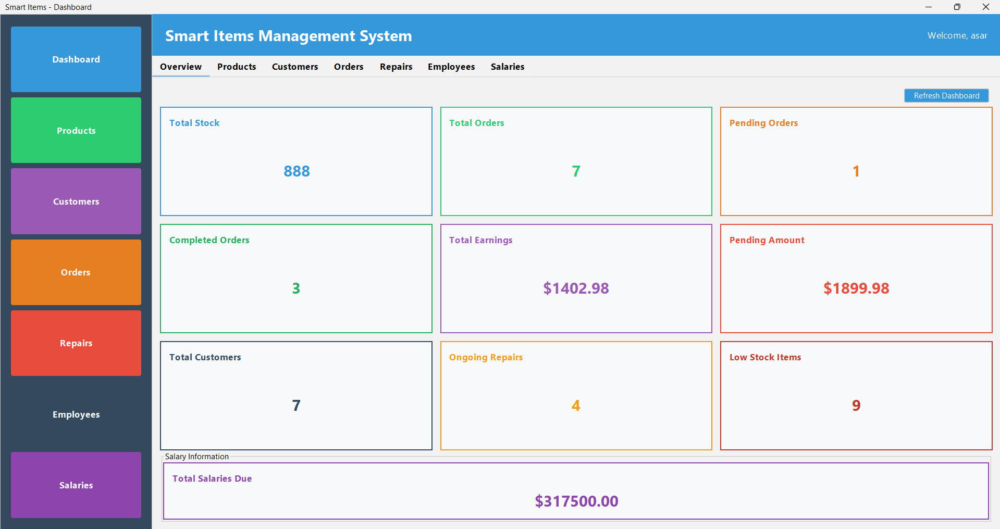
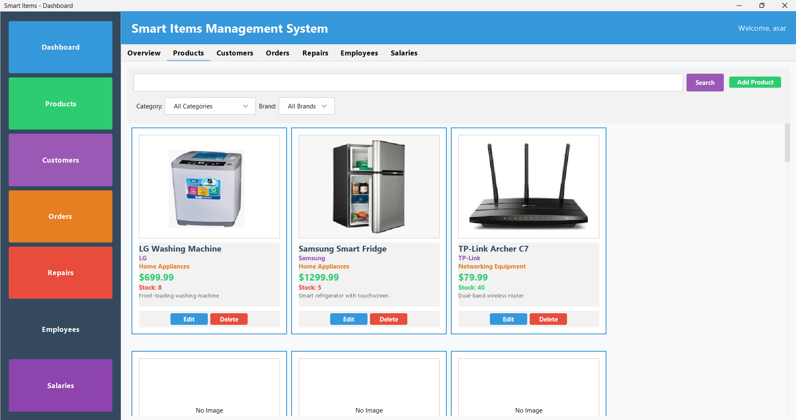
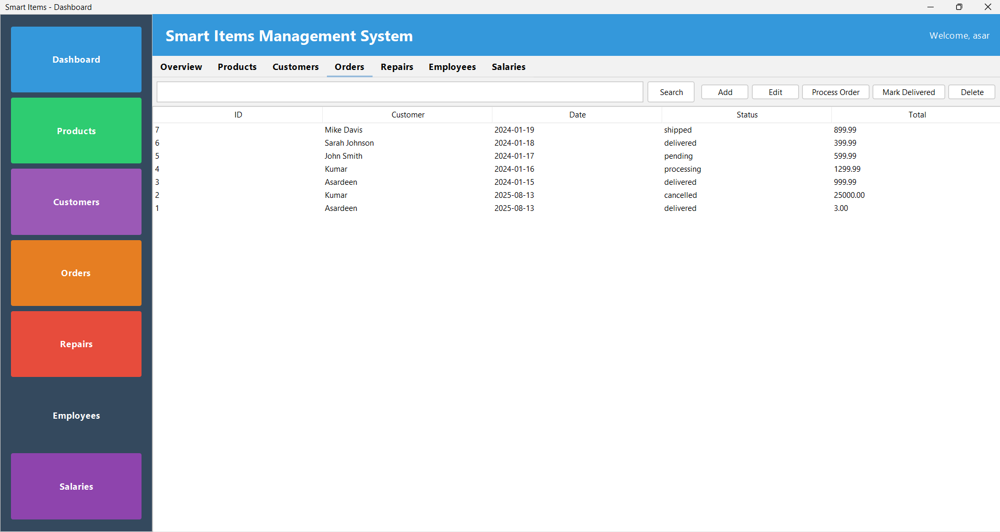
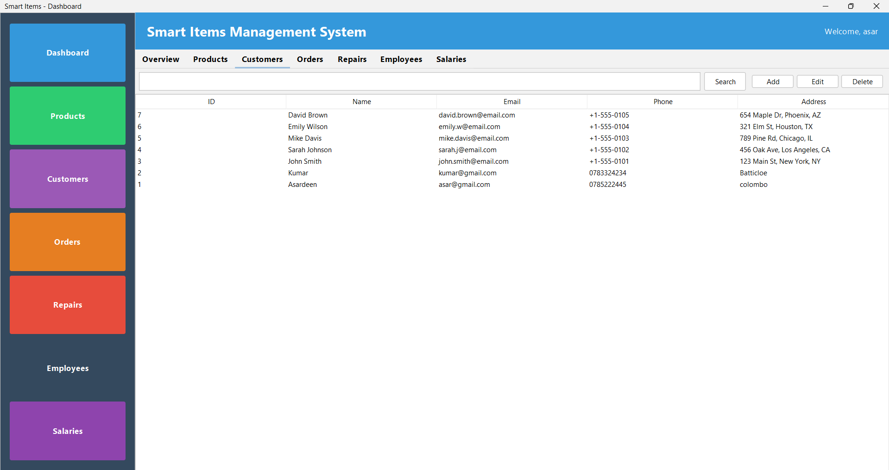
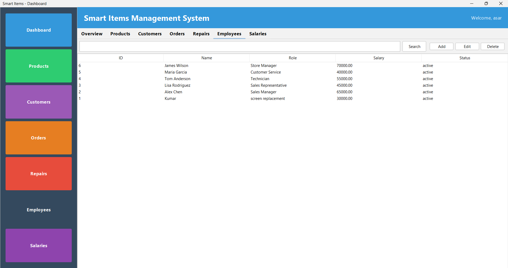
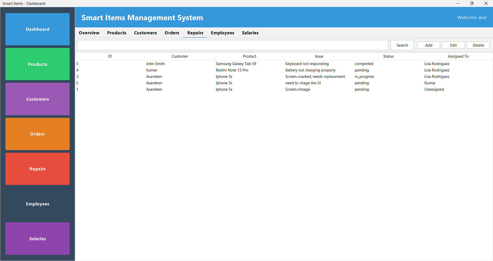
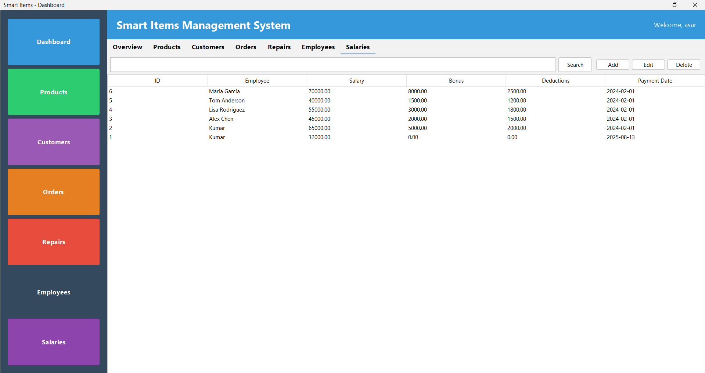
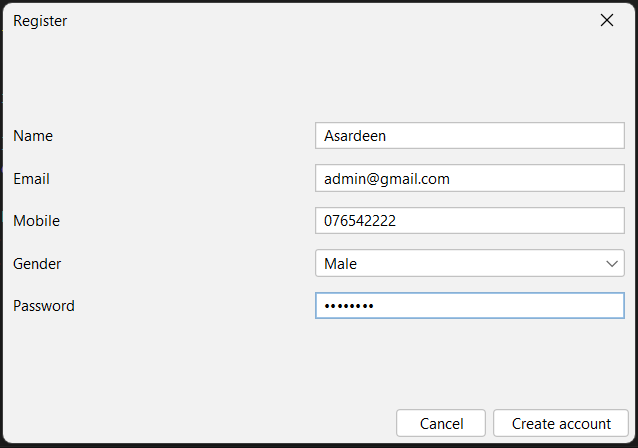
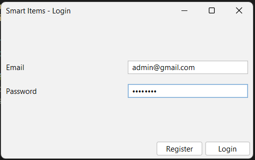

Here is a **refined and improved version** of the `README.md` file with all the necessary and important information for the **Smart Items Desktop Application**:

---

# **Smart Items Desktop Application**

A **Java Swing desktop application** designed to manage the operations of a **mobile/electronics shop**, including inventory, customer management, orders, repairs, employee information, and salaries. The application provides real-time tracking, product management with image uploads, and an intuitive user interface, offering all essential features for efficient business management.

## **Features**

* **User Authentication**:

  * Secure login and registration system with BCrypt password hashing.

* **Product Management**:

  * Add, edit, delete, and search products with stock tracking.
  * Product image upload and display.
  * Category and brand selection with predefined options (Smartphone, Tablet, Laptop, etc.).
  * Modern UI with a card-based product display.
  * Stock level monitoring and alerts for low stock.

* **Customer Management**:

  * Manage customer information, contact details, and purchase history.

* **Order Management**:

  * Create orders with product selection from dropdown.
  * Add new products directly from the order window if unavailable.
  * Track order status (Pending → Processing → Shipped → Delivered).
  * Automatic stock reduction on delivery.
  * Real-time total calculation for orders.

* **Repair Management**:

  * Track repair requests, statuses, and employee assignments.

* **Employee Management**:

  * Manage employee information, roles, and work status.

* **Salary Management**:

  * Track employee salaries, bonuses, and payments.

* **Dashboard**:

  * Real-time metrics with auto-refresh every 30 seconds.
  * Displays total stock value, pending orders, total earnings, customer summaries, salary statuses, and low stock alerts.
  * Business KPIs (Key Performance Indicators) at a glance.

## **Prerequisites**

To run this application, ensure you have the following installed:

* **Java 17 or higher**
* **MySQL 8.0 or higher**
* **Maven 3.6 or higher**

## **Database Setup**

### **Option 1: Using Setup Scripts (Recommended)**

* **Windows:**

  ```bash
  .\setup_database.bat
  ```

* **Unix/Linux:**

  ```bash
  chmod +x setup_database.sh
  ./setup_database.sh
  ```

### **Option 2: Manual Setup**

1. **Create the Database**:

   ```sql
   CREATE DATABASE smartitemsdb CHARACTER SET utf8mb4 COLLATE utf8mb4_unicode_ci;
   ```

2. **Run the schema to create tables**:

   ```bash
   mysql -u root -p smartitemsdb < src/main/resources/schema.sql
   ```

3. **Run the migration to add image support**:

   ```bash
   mysql -u root -p smartitemsdb < src/main/resources/migration.sql
   ```

### **Fixing the "Unknown column 'image\_path'" Error**

If you encounter the "Unknown column 'image\_path'" error, follow these steps:

1. **Run the migration script**:

   ```bash
   mysql -u root -p smartitemsdb < src/main/resources/migration.sql
   ```

2. **Or manually add the column**:

   ```sql
   USE smartitemsdb;
   ALTER TABLE products ADD COLUMN IF NOT EXISTS image_path VARCHAR(500) AFTER description;
   ```

---

## **Configuration**

You can configure the following environment variables (optional, defaults are provided):

* `SMART_DB_URL`: Database connection URL (default: `jdbc:mysql://localhost:3306/smartitemsdb?useSSL=false&serverTimezone=UTC`)
* `SMART_DB_USER`: Database username (default: `root`)
* `SMART_DB_PASSWORD`: Database password (default: empty)

---

## **Building the Application**

### **Using Maven**

```bash
mvn clean package
```

### **Manual Compilation**

1. Create target directories:

   ```bash
   mkdir -p target/classes target/lib
   ```

2. Copy dependencies to the `lib` directory (download JARs for dependencies like `flatlaf-3.4.jar`, `mysql-connector-j-8.0.33.jar`, `bcrypt-0.10.2.jar`).

3. Compile the source files:

   ```bash
   javac -cp "target/lib/*" -d target/classes src/main/java/com/smartitems/*.java src/main/java/com/smartitems/*/*.java
   ```

4. Create the JAR file:

   ```bash
   jar cfm target/smartitems-desktop.jar META-INF/MANIFEST.MF -C target/classes .
   ```

---

## **Running the Application**

### **Using Maven**

```bash
mvn exec:java -Dexec.mainClass="com.smartitems.App"
```

### **Using JAR file**

```bash
java -jar target/smartitems-desktop.jar
```

### **Manual Execution**

```bash
java -cp "target/classes:target/lib/*" com.smartitems.App
```

---

## **Project Structure**

```
src/main/java/com/smartitems/
├── App.java                 # Main application entry point
├── config/
│   └── Database.java        # Database connection configuration
├── dao/                     # Data Access Objects (DAO)
│   ├── CustomerDao.java
│   ├── EmployeeDao.java
│   ├── MetricsDao.java
│   ├── OrderDao.java
│   ├── OrderItemDao.java
│   ├── ProductDao.java
│   ├── RepairDao.java
│   ├── SalaryDao.java
│   └── UserDao.java
├── model/                   # Data models
│   ├── Customer.java
│   ├── Employee.java
│   ├── Order.java
│   ├── OrderItem.java
│   ├── Product.java
│   ├── Repair.java
│   ├── Salary.java
│   └── User.java
├── service/
│   └── AuthService.java     # Authentication service
└── ui/                      # User interface components
    ├── CustomersPanel.java
    ├── DashboardFrame.java
    ├── EmployeesPanel.java
    ├── LoginFrame.java
    ├── OrdersPanel.java
    ├── OverviewPanel.java
    ├── ProductsPanel.java
    ├── RegisterDialog.java
    ├── RepairsPanel.java
    └── SalariesPanel.java
```

---

## **Dependencies**

* **FlatLaf 3.4**: Modern Look & Feel for Swing applications.
* **MySQL Connector/J 8.0.33**: MySQL JDBC driver.
* **BCrypt 0.10.2**: Password hashing library.
* **SLF4J 2.0.13**: Logging framework.
* **JetBrains Annotations 24.1.0**: Optional annotations.

---

## **Troubleshooting**

### **Database Connection Issues**

* Ensure MySQL server is running.
* Verify database credentials.
* Check if the database and tables exist.
* Ensure the MySQL JDBC driver is in the classpath.

### **"Unknown column 'image\_path'" Error**

This error occurs when the database was created before image support was added. To fix:

1. **Quick Fix:** Run the migration script:

   ```bash
   mysql -u root -p smartitemsdb < src/main/resources/migration.sql
   ```

2. **Manual Fix:** Connect to MySQL and run:

   ```sql
   USE smartitemsdb;
   ALTER TABLE products ADD COLUMN image_path VARCHAR(500) AFTER description;
   ```

3. **Automatic Fix:** Restart the application — it will automatically add the missing column.

### **Compilation Issues**

* Ensure Java 17+ is installed and in PATH.
* Verify all dependencies are available.
* Check for any syntax errors in source files.

### **Runtime Issues**

* Check database connectivity.
* Verify all required JAR files are in classpath.
* Check application logs for detailed error messages.

### **Image Upload Issues**

* Ensure the image file exists and is accessible.
* Supported formats: JPG, JPEG, PNG, GIF, BMP.
* Check file permissions if using absolute paths.
* For relative paths, ensure the path is correct relative to the application.

---

## Screenshots

### Dashboard UI


### Product Management


### Order Management


### Customer Management


### Employee Management


### Repair Management


### Salaries Management


### Register Management


### Login Management


## **License**

This project is Developed by Azees Asardeen , to provided as-is for educational and demonstration purposes.